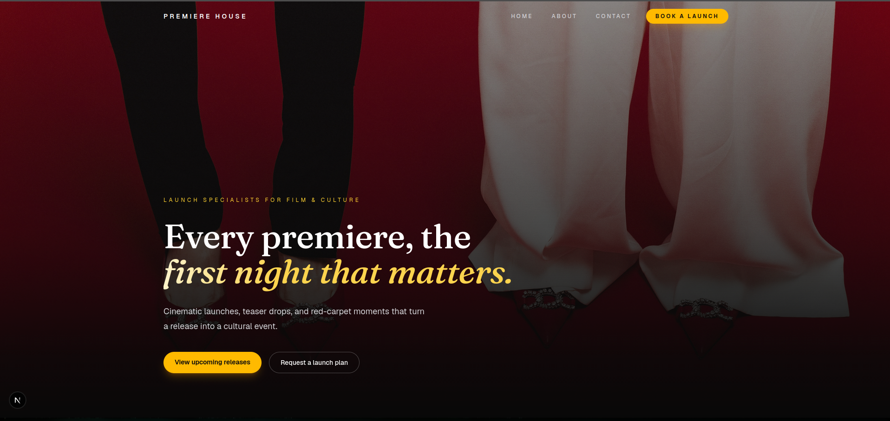
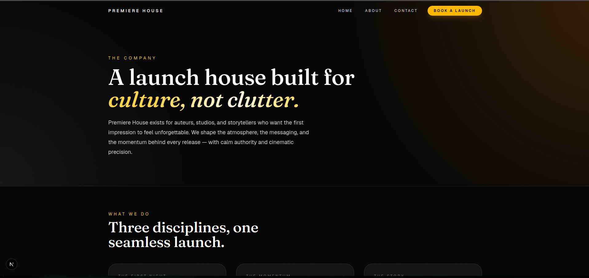
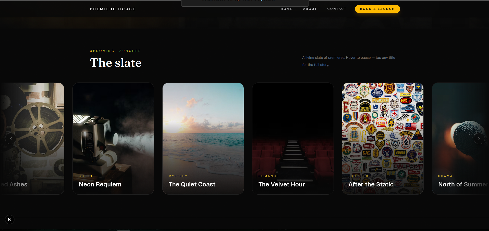
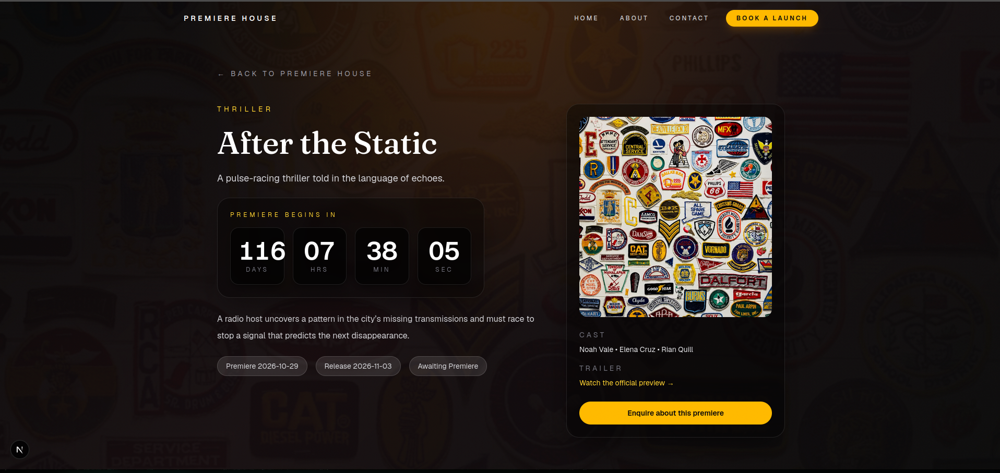
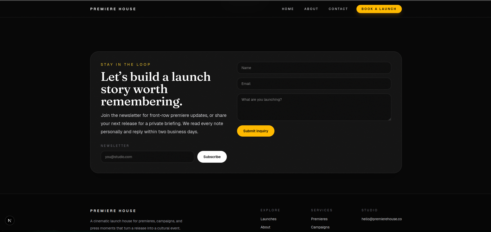
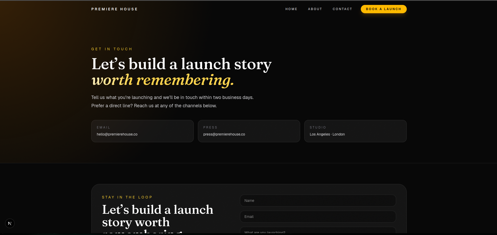

# Premiere House

A premium, cinematic website for a film launch company built with a monorepo of Next.js and a Laravel API.

## Screenshots

### Hero


### About


### Slate


### Film details


### Newsletter


### Contact


## Stack

- Next.js for the polished frontend experience
- Laravel API for film data and contact submissions
- Tailwind CSS for cinematic, responsive styling

# Trade-offs
1. The API is intentionally lightweight to keep the project fast to run locally while still supporting real dynamic data and persistence.
2. A SQLite database is used in the backend to avoid a separate database deployment. A script seeds the initial film data on the database

## Run locally

1. Install frontend dependencies:
   ```bash
   cd frontend
   npm install
   npm run dev
   ```
2. In a second terminal, start the Laravel API:
   ```bash
   cd api/laravel
   composer install
   php artisan migrate --seed   # creates tables and seeds the film catalog
   php artisan serve --host 127.0.0.1 --port 8000
   ```
3. Open http://localhost:3000 to view the site. The frontend consumes the Laravel API from http://localhost:8000.

## Deployment

The frontend deploys to **Vercel** and the API to **Render**. The two are linked
entirely through environment variables, so no URLs are hardcoded.

### Backend — Render

1. Push this repo to GitHub.
2. In Render: **New > Blueprint** and select the repo. The included
   [`render.yaml`](render.yaml) provisions a Docker web service from
   [`api/laravel/Dockerfile`](api/laravel/Dockerfile).
3. Set the environment variables Render marks as required:
   - `APP_KEY` — generate with `php artisan key:generate --show` and paste the
     `base64:...` value.
   - `APP_URL` — the URL Render assigns (e.g. `https://premiere-house-api.onrender.com`).
   - `FRONTEND_URL` — the Vercel URL, used for CORS (e.g. `https://premiere-house.vercel.app`).
     Comma-separate multiple origins, or use `*` to allow any.
4. Deploy. The API is served at `<APP_URL>/api`.

The Docker start command runs migrations and reseeds the film catalog
(`FilmSeeder`) on every deploy, so the demo films are always present.

> Note: the service uses SQLite on Render's ephemeral disk. The film catalog is
> re-seeded on each deploy, but user-generated contact/newsletter submissions
> reset on redeploy. Attach a persistent disk or a managed Postgres for durable
> storage.

### Frontend — Vercel

1. Import the repo into Vercel and set the **Root Directory** to `frontend`.
2. Add the environment variable:
   - `NEXT_PUBLIC_API_BASE` — the API base including `/api`, e.g.
     `https://premiere-house-api.onrender.com/api`.
3. Deploy.

Each side has an `.env.example` documenting its variables
([`frontend/.env.example`](frontend/.env.example),
[`api/laravel/.env.example`](api/laravel/.env.example)).

## API endpoints

The Laravel backend exposes:

- GET /api/films
- GET /api/films/{id}
- POST /api/contact

## Development notes

- The frontend calls the API directly from the Next.js app.
- The Laravel backend is intentionally lightweight and serves the film catalog and inquiry form.
- The film catalog lives in the database and is populated by [`FilmSeeder`](api/laravel/database/seeders/FilmSeeder.php); the seeder is idempotent (keyed on title) and runs on every deploy.
